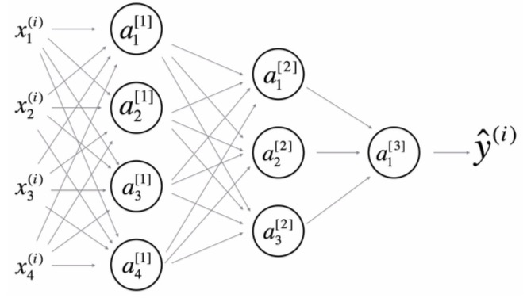

<h1 align="center">C1W4 深层神经网络</h1>

## 测验
___
> 1、在实现前向传播和反向传播中使用的“cache”是什么？
- [ ] 它用于跟踪我们正在搜索的超参数，以加速计算。
- [ ] 用于在训练期间缓存代价函数的中间值。
- [ ] 我们使用它传递反向传播中计算的变量到相应的前向传播步骤，它包含对于前向传播计算导数有用的变量。
- [x] 我们使用它传递前向传播中计算的变量到相应的反向传播步骤，它包含对于反向传播计算导数有用的变量。
___
> 2、以下哪些是“超参数”？
- [x] 隐藏层的大小
- [x] 神经网络的层数
- [ ] 激活值
- [ ] 权重
- [x] 学习率
- [x] 迭代次数
- [ ] 偏置
___
> 3、下列哪个说法是正确的？
- [x] 神经网络的更深层通常比前面层计算更复杂的输入特征。
- [ ] 神经网络的前面层通常比更深层计算更复杂的输入特性。
___
> 4、向量化允许在L层神经网络中计算前向传播，而不需要在层(l = 1,2，…，L)上显式的使用for-loop（或任何其他显式迭代循环），正确吗？
- [ ] 正确
- [x] 错误
___
> 5、假设我们将n[l]的值存储在名为layers的数组中，如下所示：layer_dims = [n_x,4,3,2,1]。 因此，第1层有四个隐藏单元，第2层有三个隐藏单元，依此类推。 您可以使用哪个for循环初始化模型参数？
- [ ] A.
>       for(i in range(1, len(layer_dims)/2)):
>           parameter[‘W’ + str(i)] = np.random.randn(layers[i], layers[i-1])) * 0.01
>           parameter[‘b’ + str(i)] = np.random.randn(layers[i], 1) * 0.01
- [ ] B.
>       for(i in range(1, len(layer_dims)/2)):
>           parameter[‘W’ + str(i)] = np.random.randn(layers[i], layers[i-1])) * 0.01
>           parameter[‘b’ + str(i)] = np.random.randn(layers[i-1], 1) * 0.01
- [ ] C.
>       for(i in range(1, len(layer_dims))):
>           parameter[‘W’ + str(i)] = np.random.randn(layers[i-1], layers[i])) * 0.01
>           parameter[‘b’ + str(i)] = np.random.randn(layers[i], 1) * 0.01
- [x] D.
>       for(i in range(1, len(layer_dims))):
>           parameter[‘W’ + str(i)] = np.random.randn(layers[i], layers[i-1])) * 0.01
>           parameter[‘b’ + str(i)] = np.random.randn(layers[i], 1) * 0.01
    
___
> 6、下面关于神经网络的说法正确的是：

- [x] 总层数L为4，隐藏层层数为3。
- [ ] 总层数L为3，隐藏层层数为3。
- [ ] 总层数L为4，隐藏层层数为4。
- [ ] 总层数L为5，隐藏层层数为4。
___
> 7、在前向传播期间，在层l的前向传播函数中，您需要知道层l中的激活函数（Sigmoid，tanh，ReLU等）是什么， 在反向传播期间，相应的反向传播函数也需要知道第l层的激活函数是什么，因为梯度是根据它来计算的。这样描述正确吗？
- [x] 正确
- [ ] 错误
___

> 8、有一些功能具有以下属性：

>(i) 利用浅网络电路计算一个函数时，需要一个大网络（我们通过网络中的逻辑门数量来度量大小），但是（ii）使用深网络电路来计算它，只需要一个指数较小的网络。真/假？
- [x] 正确
- [ ] 错误
___
> 9、在2层隐层神经网络中，下列哪个说法是正确的？

- [x] W[1] 的维度为 (4, 4)
- [x] b[1] 的维度为 (4, 1)
- [ ] W[1]的维度为 (3, 4)
- [ ] b[1] 的维度为 (3, 1)

- [x] W[2]的维度为 (3, 4)
- [ ] b[2] 的维度为 (1, 1)
- [ ] W[2]的维度为 (3, 1)
- [x] b[2] 的维度为 (3, 1)

- [ ] W[3]的维度为 (3, 1)
- [x] b[3] 的维度为 (1, 1)
- [x] W[3]的维度为 (1, 3)
- [ ] b[3] 的维度为 (3, 1)

___
> 10、前面的问题使用了一个特定的网络，一般情况下, 与层l有关的权重矩阵W[l]的维数是多少?
- [x] W[l]的维度是 (n[l], n[l−1])
- [ ] W[l]的维度是 (n[l-1], n[l])
- [ ] W[l]的维度是 (n[l+1], n[l])
- [ ] W[l]的维度是 (n[l], n[l+1])
___

